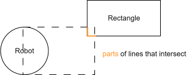
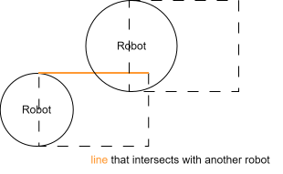

# ICP Project: Simple 2D robot collision simulator

## Divided libraries
Application is made out of two parts, **2DSimulationLib** and **QtSpecific** (names of the directories). The reasoning is that simulation where all collisions and calculations are being done, are separated from the Qt application (window/GUI). This way the GUI is simply copying the positions of the simulation objects like Robot and Rectangle, and are projected into GUI by changing positions of Obstacle objects and BaseRobot (AutoRobot / ManualRobot) objects.

GUI interacts with Simulator by method calls (for example for adding new robot).

## Multiple threads
The **Simulator** can be run on either one or multiple threads at once, for this **SimulationCore** objects within the Simulator are used. SimulationCores are run on independent threads, waiting for the main thread (where Simulator is running) to signal them to run one simulation cycle. Number of robots to be simulated is balanced between all initialized SimulationCores. Multiple threads trying to access the same data at the same time could cause a problem with synchronization, which is slightly mitigated by the mechanism of SimulationCores having a fixed set of robots to simulate. However, it can cause imprecisions in simulation (read-after-write or write-after-read), the higher the speed of the robots the higher imprecisions can be caused.  

By default program starts with 0 threads, therefore simulation cycle is run by the main thread, this can be changed in the World menu to change the number of threads. 

## Class Diagram
This diagram is only conceptual, it does not show all attributes or methods in the classes.

 

## 2D Simulation Library
For this project a custom 2D simulation library was written, Qt does contain a collision system, however, as an author I decided to not use it even at the cost of performance (since Qt collision system might be better optimized).

 

In the diagram of class inheritance, it can be seen that the class Rectangle inherits from the Circle class. This is so that detailed collision detection can be skipped, in case Rectangle is far away from Robot. This is because the function for an intersection between two circles is easier to compute than the intersection of Rectangle with Circle, or Rectangle with Rectangle. For this reason, Rectangles have a radius stored for faster collision detection.

 

Robots move forward in a given direction, this means that the simple circle intersection will not be enough. For this reason, a rectangle collider is given to Robot. Then a Rectangle with Rectangle intersection is calculated which can decide more precisely whenever robot is colliding with obstacles or not. Rectangle collision is the same as a 4-sided convex polygon intersection because these rectangles can be rotated. This is done by checking if lines of two rectangles intersect, if yes, a collision occurred.
*(Source for line intersection: [https://www.geeksforgeeks.org/check-if-two-given-line-segments-intersect/](https://www.geeksforgeeks.org/check-if-two-given-line-segments-intersect/))*

 

Because Robots are circles (geometrically) collisions between them need to be calculated in another way. For this collider inside Robot can be broken into 4 lines, which are then checked for intersection with other Robots/Circles. 
*(Source for line-circle intersection: [https://www.youtube.com/watch?v=ebq7L2Wtbl4](https://www.youtube.com/watch?v=ebq7L2Wtbl4))*

 

It should be noted that these algorithms need to as fast as possible (for the user to not see any hitching/stuttering in the image), that is why it is better to store hard-to-calculate values like sinus or cosine, for that reason, Circle class contains these values as attributes.

## QtSpecific
QtSpecific contains classes that are specific for Qt and does not implement calculation algorithms for simulation. Its purpose is to wrap around classes that perform simulation calculations and display them correctly, while also allowing users to interact with them (moving Robot/Obstacle around). By looking at Class Diagram it can be seen that BaseRobot inherits from QGraphicsPixmapItem which is a class that represents an object that will be displayed in the user interface. BaseRobot also contains Robot as one of its attributes, BaseRobot is then periodically called to adjust its position in the user interface to be aligned with the simulation.